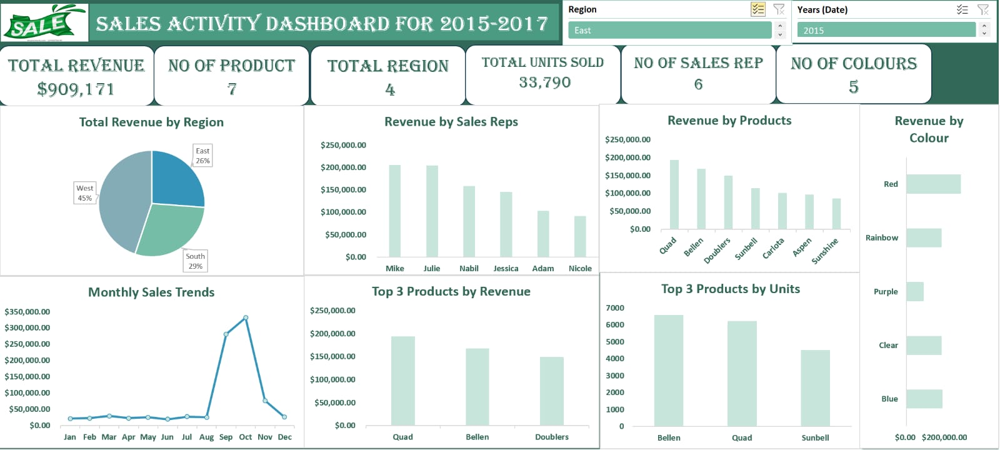
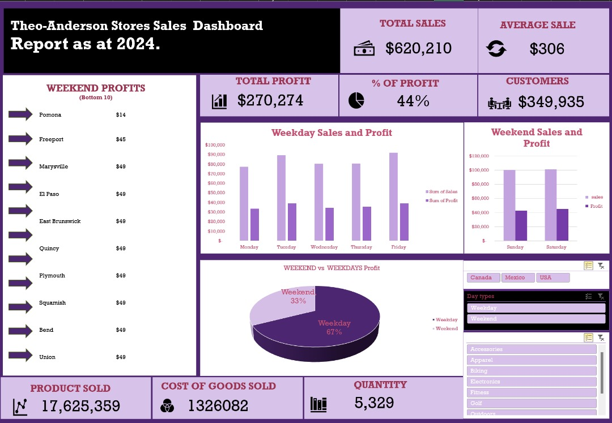

**PORTFOLIO**

**About Me**
# Hi there, I'm Rotimi Fiyinfoluwa Deborah! 👋
* **Soil Scientist , Data Analyst | SQL Specialist | Google Data Analytics Professional Candidate**

I am a detail-oriented Data Analyst with a background in Soil Science and Land Resources Management from FUOYE. I specialize in transforming complex datasets into clear, actionable business insights. With a logical and analytical mindset, I bridge the gap between raw data and stakeholder decision-making.

---

### 🛠️ Skills & Competencies
* **Data Analysis:** Data Cleaning, Transformation, Trend Identification, and Statistical Interpretation.
* **Database Management:** Relational Database Design, Schema Management, and Complex SQL Querying.
* **Data Visualization:** Dashboard Design (UI/UX), Storytelling with Data, and KPI Reporting.
* **Soft Skills:** Logical Problem Solving, Attention to Detail, and Stakeholder Communication.

---

### ⚙️ Technical Toolbox
* **Databases:** SQL (PostgreSQL, MySQL, SQLite)
* **Spreadsheets:** Microsoft Excel (VLOOKUP, Pivot Tables, Power Query), Google Sheets
* **Visualization:** Power BI, Tableau (Learning)
* **Programming:** R (Actively mastering via Google/Coursera)

---

### 🎓 Education & Professional Training
* 🎓 **B. Agric (Soil Science and Land Resources Management)** | Federal University Oye-Ekiti (FUOYE)
* 🌲 **Stanford Online:** Databases: Relational Databases and SQL
* 🛡️ **NUPAT Technologies:** Data Science & Analytics (Nupat Code Camp)
* 🎓 **Labano Academy:** Data Analysis Program Graduate

---

### ⚡ Current Focus
* 🎓 **In Progress:** [Google Data Analytics Professional Certificate](https://www.coursera.org/professional-certificates/google-data-analytics) (Coursera)
  * *Focusing on: Data Ethics, R Programming, and advanced Tableau visualization.*

---

### 📊 Featured Data Projects

### README.md
### Project: Trans-Regional Soil Fertility & Yield Gap Analysis (A Comparative BI Study of Ireland vs. Nigeria)
  ### Executive Summary
This project presents a longitudinal comparative study (2018–2024) of agricultural productivity across two distinct ecological zones: the Temperate Maritime climate of Ireland and the Tropical climate of Nigeria. By integrating soil chemical data (N−P−K) with environmental metrics (Rainfall/Temperature), this interactive solution identifies the drivers of crop performance and nutrient efficiency across borders.
 ### 

 ## **The Problem Statement:**
 * **The "Yield Gap"** Challenge Global food security is hindered by a widening productivity gap between developed and developing agricultural systems.
 * **The Efficiency Paradox:** Despite high land availability, tropical systems often see lower returns on fertilizer inputs compared to temperate systems.
 * **Climate Leaching:** Traditional soil management often ignores the impact of high-intensity precipitation on nutrient availability, leading to environmental waste.
 * **Static Reporting:** A lack of integrated, real-time tools prevents researchers from visualizing the intersection of chemistry and climate.
 ## **Strategic Recommendations** 
* **Precision Management**: Shift from "blanket fertilization" to site-specific Nitrogen Stabilization in tropical regions to mitigate leaching.
* **Climate-Smart Selection**: Deploy crop varieties specifically bred for high-rainfall zones, as identified in the Climate Correlation analysis.
* **Digital Scaling** : Expand the use of interactive BI tools at the farm-gate level to allow for real-time soil health interventions.
* **Tools:**  Power BI Desktop using advanced features like Edit Interactions, Synced Slicers, and Geographic Data Categorization.

  
   
#### 📉 [Multi-Year Sales Activity Dashboard (2015-2017)](https://github.com/fiyinrotimi/Historical-Sales-Activity)
### 
* **The Insight:** Uncovered a massive Q4 revenue surge and identified the West Region as the primary revenue driver (45%).
* **Recommendations:**  Use YoY comparison lines to verify seasonality; Introduce "Revenue per Unit" metrics for premium product identification.
* **Tools:** Trend Analysis, Performance Benchmarking, Data Transformation.

#### 📈 [Theo-Anderson Stores Sales Analysis (2024)](https://github.com/fiyinrotimi/Theo-Anderson-Sales-Analysis)
### 
* **The Insight:** Identified that 67% of profits occur on weekdays and pinpointed "Bottom 10" weekend locations for targeted growth.
* **Recommendations:**  Implement a data dictionary for scale metrics; Conduct site-specific performance audits for low-profit weekend locations.
* **Tools:** Advanced Excel, Dashboard Design, KPI Tracking.

---

### 📫 Let's Connect!
- **Email:** fiyin@rotimi.com
- **Phone Number:** +2349034455206

*"I approach every dataset with a logical mindset, looking for the story behind the numbers."*
